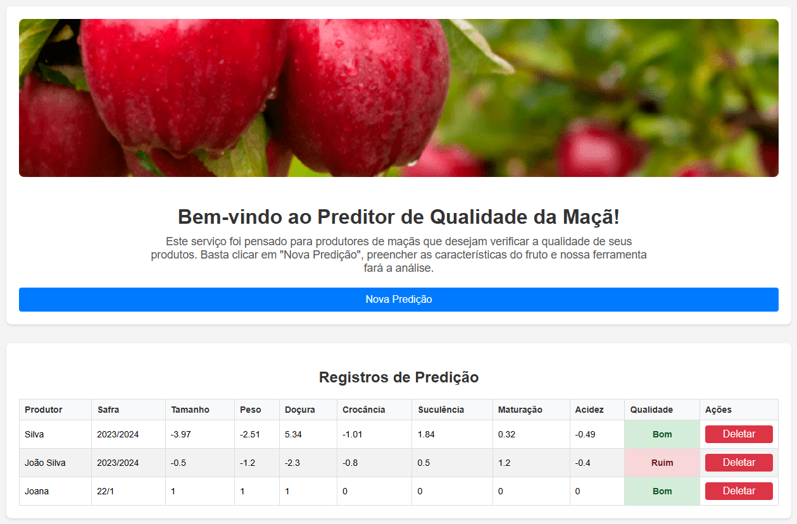

# API de Predição da Qualidade da Maçã

Este projeto é um Mínimo Produto Viável (MVP) desenvolvido para a pós-graduação em Engenharia de Software da PUC-RJ. A aplicação consiste em um sistema web que utiliza um modelo de Machine Learning para prever a qualidade de maçãs com base em suas características.

## 🖼️ Tela da Aplicação



## 🚀 Tecnologias Utilizadas

- **Backend:** Python, Flask, Flask-OpenAPI3, SQLAlchemy
- **Frontend:** HTML, CSS, JavaScript
- **Machine Learning:** Scikit-learn
- **Banco de Dados:** SQLite

## 📂 Estrutura do Projeto

```
.
├── api/                # Contém a aplicação backend em Flask
│   ├── model/
│   ├── schemas/
│   ├── app.py
│   └── test_api.py
├── database/           # Diretório onde o banco de dados SQLite é armazenado
├── front/              # Contém os arquivos do frontend
│   ├── css/
│   ├── js/
│   └── index.html
└── MachineLearning/    # Contém o pipeline do modelo de Machine Learning
    └── pipelines/
        └── svm_apple_quality.pkl
```

## 🏁 Como Executar

### Pré-requisitos

- Python 3.x

### Instalação e Execução

1.  Instale as dependências necessárias (recomenda-se o uso de um ambiente virtual):
    ```bash
    pip install Flask Flask-Cors Flask-OpenAPI3 SQLAlchemy sqlalchemy-utils pydantic scikit-learn
    ```

2.  Navegue até o diretório da API e inicie o servidor Flask:
    ```bash
    cd api
    python app.py
    ```

3.  Abra seu navegador e acesse a aplicação em: `http://127.0.0.1:5000`

## ✨ Frontend

A interface do usuário é uma aplicação de página única que permite:

- **Visualizar Predições**: Uma tabela exibe todas as predições de qualidade de maçã salvas. A qualidade é destacada como "Bom" (verde) ou "Ruim" (vermelho).
- **Adicionar Nova Predição**: Um formulário em um modal permite inserir os dados de uma nova maçã para obter a predição de sua qualidade.
- **Deletar Predições**: Cada registro na tabela possui um botão "Deletar" para remover a predição do sistema.

## 🔗 API Endpoints

- `GET /`: Redireciona para a página `index.html` do frontend.
- `GET /documentacao`: Redireciona para a documentação interativa da API (Swagger UI).
- `GET /predictions`: Retorna uma lista com todas as predições realizadas.
- `POST /predictions`: Adiciona uma nova predição.
- `DELETE /predictions`: Remove uma predição existente com base no seu `id`.
